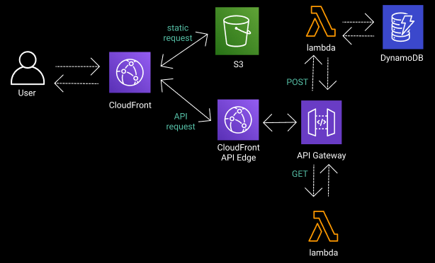
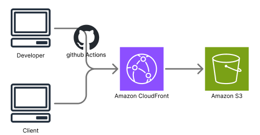
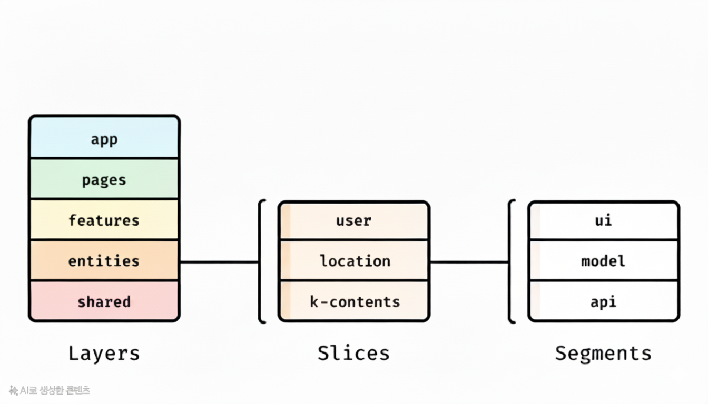
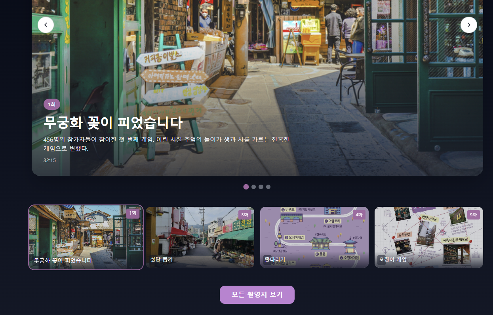
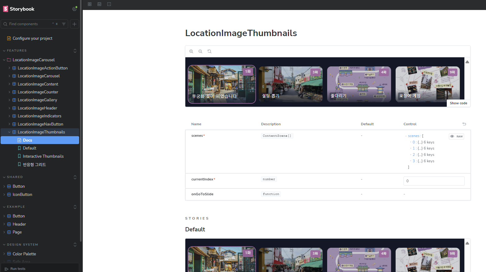

# 🎬 K-SPOT

> **한국 콘텐츠 촬영지 탐방 서비스**  
> 체계적인 아키텍처 설계와 현대적 개발 워크플로우를 통해 구축된 프로덕션 레디 웹 애플리케이션

---

## 🏗️ 아키텍처 & 개발 철학

### 1. 🎯 Frontend 아키텍처



**서버리스 API 기반 Frontend 아키텍처**

- **CloudFront + API Gateway + Lambda** 완전 서버리스 구조
- **S3 정적 호스팅**으로 Frontend 배포
- **Backend 통합 전 독립적인 서버리스 API** 운영 중
- **CDN 배포를 통한 글로벌 API 서비스** 제공으로 빠른 응답 속도 보장

### 2. 🚀 CI/CD 자동화 파이프라인



- **GitHub Actions** 기반 완전 자동화된 배포 파이프라인
- **Amazon CloudFront** 정적 사이트 배포로 글로벌 CDN 활용
- **PR 단위 품질 관리**
  - ESLint/Prettier 사전 검증
  - **Gemini AI 자동 코드 리뷰** 시스템 도입
  - 테스트 자동 실행으로 배포 전 품질 보장

### 3. 📐 Feature-Sliced Design (FSD) 아키텍처



**5-레이어 구조로 확장성과 유지보수성 극대화**

```
app/     → 애플리케이션 진입점 및 글로벌 설정
pages/   → 페이지 컴포넌트 (조립만 담당)
features/→ 비즈니스 로직 및 사용자 인터랙션
entities/→ 도메인 엔티티
shared/  → 공통 유틸리티 및 UI 컴포넌트
```

**핵심 설계 원칙**

- ✅ **완벽한 캡슐화**: `features`에서 최상위 컴포넌트만 export
- ✅ **관심사 분리**: UI/로직/상수/타입 완전 분리
- ✅ **단방향 의존성**: 상위 → 하위 레이어만 참조 가능
- ⚠️ `widgets` 레이어 의도적 제외 (의견 충돌 방지, 추후 마이그레이션 고려)

### 4. 🎨 Tailwind CSS v4 - CSS-First 철학


- **CSS-First 접근법**으로 고성능 빌드 최적화
- 런타임 성능을 고려한 **커스텀 테마 시스템** 구축
- Design Token 기반 일관된 디자인 시스템

**서비스 테마 시스템 구축**



- **통합 테마 시스템** 정의 및 적용
- 기존 컴포넌트들에 **일관된 디자인 토큰** 적용
- 브랜드 아이덴티티를 반영한 **컬러 팔레트** 및 **타이포그래피** 체계화
- **다크모드 대응** 준비 완료

**테마 토큰 구조**

```
src/
├── index.css                    → 글로벌 스타일 진입점
└── app/styles/
    ├── theme/
    │   ├── _colors.css         → 컬러 팔레트 토큰
    │   ├── _spacing.css        → 간격 시스템 토큰
    │   ├── _shadows.css        → 그림자 효과 토큰
    │   ├── _zindex.css         → 레이어 순서 토큰
    │   └── _animations.css     → 애니메이션 토큰
    └── utilities/
        ├── _typography.css     → 타이포그래피 유틸리티
        └── _safearea.css       → 모바일 세이프 에어리어
```

### 5. 📖 Storybook 기반 컴포넌트 문서화


- **Presentational 컴포넌트 100% 스토리 작성** 원칙
- 격리된 환경에서의 UI 테스트 및 문서화
- 디자이너-개발자 간 효율적인 협업 도구

**Storybook UI 테스팅 환경 구축**



- **LocationImageCarousel** 등 주요 컴포넌트 스토리 작성 완료
- **컴포넌트 문서화** 자동화로 개발팀 협업 효율성 향상
- **반응형 디자인** 검증을 위한 뷰포트 테스트 추가

**공통 UI 컴포넌트 구조**

```
src/shared/ui/
├── index.ts                     → Public API 정의
├── Button/
│   ├── Button.tsx              → 기본 버튼 컴포넌트
│   └── Button.stories.tsx      → 버튼 스토리북
└── IconButton/
    ├── IconButton.tsx          → 아이콘 버튼 컴포넌트
    └── IconButton.stories.tsx  → 아이콘 버튼 스토리북
```

---

## 📋 개발 워크플로우

### 코드 품질 관리

- **ESLint + Prettier** 자동 포매팅
- **Pre-commit Hooks** 품질 검증
- **Issue/PR 템플릿** 표준화된 협업 프로세스

### 브랜치 전략

- `main`: 프로덕션 배포 브랜치
- `develop`: 개발 통합 브랜치
- `release`: 안정화 브랜치
- `feature/*`: 기능 개발 브랜치

---

## 🚀 최근 구현 사항 (이번 주)

### 🔗 API 통합 및 데이터 레이어 구축

- 이번주의 가장 큰 목표는 "백엔드와의 API 연동과 반응형 디자인 입히기" 입니다.

- **홈페이지, 장소 상세,**: 백엔드의 api를 사용하도록 변경했습니다.
- **인증/인가 구현하기**: 로그인,회원가입,비밀번호 재설정 등 이메일 인증과정을 포함한 전과정 구현
- **마이페이지 구현**: 사용자가 저장한 동선정보를 볼 수 있는 마이페이지를 구현했습니다.
- **반응형 디자인 구현**: 모든 페이지에 반응형 디자인을 입혔습니다.

---

이주의 TMI :
_"좋은 아키텍처는 결정을 늦출 수 있게 해준다" - Robert C. Martin_
