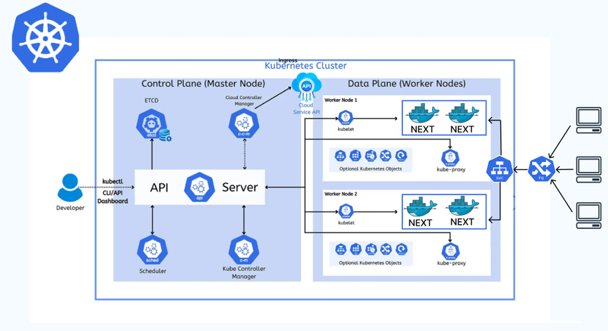
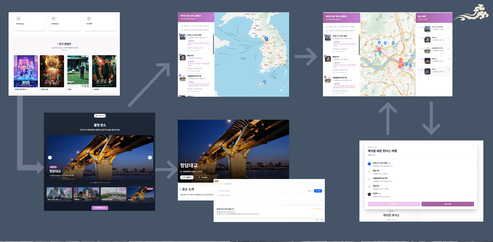
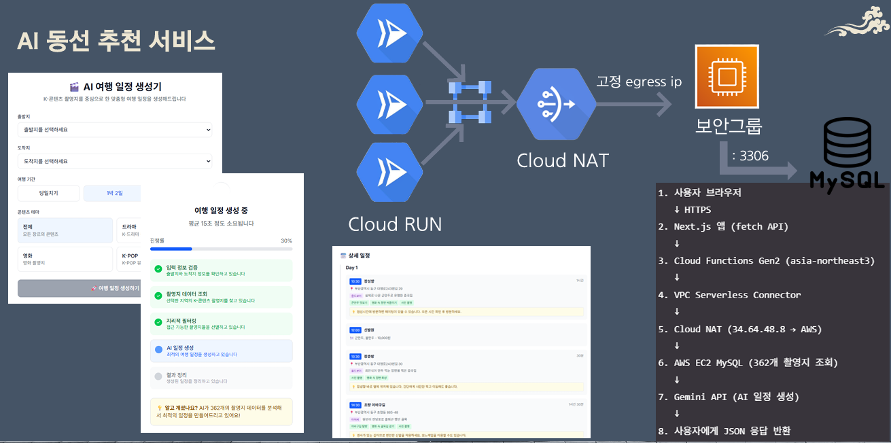

# 🎬 K-SPOT

> **한국 콘텐츠 촬영지 탐방 서비스**  
> 체계적인 아키텍처 설계와 현대적 개발 워크플로우를 통해 구축된 프로덕션 레디 웹 애플리케이션

---

## 🏗️ 아키텍처 & 개발 철학

### 1. 🎯 Frontend 아키텍처

#### 1-1. Next.js 버전 (Kubernetes 배포)



**GCP Kubernetes Engine 기반 컨테이너 배포**

- **GitHub Actions → Artifact Registry → GKE** 완전 자동화 파이프라인
- **Docker 컨테이너화**로 일관된 배포 환경 보장
- **Kubernetes 오케스트레이션**
  - HPA (Horizontal Pod Autoscaler): CPU/메모리 기반 자동 스케일링 (2-6 replicas)
  - VPA (Vertical Pod Autoscaler): 리소스 사용량 모니터링 및 권장사항 제공(적용X)
  - Ingress + SSL 인증서: HTTPS 도메인 연결 (kspot.site)
  - k6 짧은 부하 모니터링 : 1vCPU 노드풀로 150TPS, 1000명의 현실적인 요청 처리가능 
- **고가용성 및 무중단 배포** 지원

#### 1-2. Vite 버전 (main, dev 운영 중)


**S3 + CloudFront 정적 호스팅 구조**

- **S3 정적 호스팅**으로 Frontend 배포
- **CloudFront CDN**을 통한 글로벌 배포 및 캐싱
- **GitHub Actions** 기반 자동 배포 파이프라인
- 빠른 로딩 속도와 높은 가용성 보장


### 2. 🌐 서버리스 API 아키텍처 (Vite 버전 전용)


**CloudFront + API Gateway + Lambda 완전 서버리스 구조**

- **API Gateway + Lambda** 서버리스 백엔드 API
- **CloudFront CDN**을 통한 글로벌 API 서비스 제공
- **Backend 통합 전 독립적인 서버리스 API** 운영
- 빠른 응답 속도와 자동 스케일링 지원

### 2-1. 🎯 서비스 플로우



**K-Contents 데이터 수집 및 가공 프로세스**

- **외부 API 연동**: 1,000개 가량의 K-Contents 데이터 수집
- **연관 K-명소 매핑**: 콘텐츠와 연관된 촬영지 및 관광명소 데이터 저장
- **AI 기반 필터링**: AI를 활용한 데이터 품질 향상 및 중복 제거
- **콘텐츠 상세 제공**: 드라마/영화 정보, 촬영지 상세 정보 서비스
- **지도 기반 동선 서비스**: 사용자 맞춤형 여행 코스 생성 및 수정 기능

---

### 4. 📐 Feature-Sliced Design (FSD) 아키텍처


**5-레이어 구조로 확장성과 유지보수성 극대화**

```
app/     → 애플리케이션 진입점 및 글로벌 설정
pages/   → 페이지 컴포넌트 (조립만 담당)
features/→ 비즈니스 로직 및 사용자 인터랙션
entities/→ 도메인 엔티티
shared/  → 공통 유틸리티 및 UI 컴포넌트
```

**핵심 설계 원칙**

- ✅ **완벽한 캡슐화**: `features`에서 최상위 컴포넌트만 export
- ✅ **관심사 분리**: UI/로직/상수/타입 완전 분리
- ✅ **단방향 의존성**: 상위 → 하위 레이어만 참조 가능
- ⚠️ `widgets` 레이어 의도적 제외 (협업에서의 이점이 크다고 판단)

### 5. 🎨 Tailwind CSS v4 - CSS-First 철학


- **CSS-First 접근법**으로 고성능 빌드 최적화
- 런타임 성능을 고려한 **커스텀 테마 시스템** 구축
- Design Token 기반 일관된 디자인 시스템

**서비스 테마 시스템 구축**


- **통합 테마 시스템** 정의 및 적용
- 기존 컴포넌트들에 **일관된 디자인 토큰** 적용
- 브랜드 아이덴티티를 반영한 **컬러 팔레트** 및 **타이포그래피** 체계화
- **다크모드 대응** 준비 완료

**테마 토큰 구조**

```
src/
├── index.css                    → 글로벌 스타일 진입점
└── app/styles/
    ├── theme/
    │   ├── _colors.css         → 컬러 팔레트 토큰
    │   ├── _spacing.css        → 간격 시스템 토큰
    │   ├── _shadows.css        → 그림자 효과 토큰
    │   ├── _zindex.css         → 레이어 순서 토큰
    │   └── _animations.css     → 애니메이션 토큰
    └── utilities/
        ├── _typography.css     → 타이포그래피 유틸리티
        └── _safearea.css       → 모바일 세이프 에어리어
```

### 6. 📖 Storybook 기반 컴포넌트 문서화, Playwright E2E TEST


- **Presentational 컴포넌트 스토리 작성** 원칙
- 격리된 환경에서의 UI 테스트 및 문서화
- 디자이너-개발자 간 효율적인 협업 도구
- **E2E 테스트** 환경 구축으로 사용자 시나리오 검증

**Storybook UI 테스팅 환경 구축**


- **LocationImageCarousel** 등 주요 컴포넌트 스토리 작성 완료
- **컴포넌트 문서화** 자동화로 개발팀 협업 효율성 향상
- **반응형 디자인** 검증을 위한 뷰포트 테스트 추가
- **E2E 테스트** 시나리오 작성으로 사용자 경험 품질 보장

---

### 7. 🤖 AI 동선 추천 시스템



**서버리스 AI 추천 시스템 아키텍처**

- **Cloud Run 서버리스 함수 고정 IP 할당**: NAT Gateway를 통한 고정 IP 설정으로 보안 그룹 화이트리스트 관리
- **MySQL 데이터베이스 연동**: MySQL과 안전한 연결을 위한 VPC 보안 그룹 구성
- **LLM API 통합**: Gemini API와 연동하여 사용자 선호도 기반 맞춤형 동선 생성
- **실시간 추천 엔진**: 교통 허브, 관심사, 여행 기간을 고려한 개인화된 여행 코스 제안

**핵심 기능**

- 사용자 선호도 분석 및 맞춤형 코스 생성
- 실시간 위치 기반 주변 촬영지 추천
- 교통편 및 소요시간을 고려한 최적 경로 계산

---

## 📋 개발 워크플로우

### 코드 품질 관리

- **ESLint + Prettier** 자동 포매팅
- **Pre-commit Hooks** 품질 검증
- **Issue/PR 템플릿** 표준화된 협업 프로세스

### 브랜치 전략

- `main`: 프로덕션 배포 브랜치
- `develop`: 개발 통합 브랜치
- `release`: 안정화 브랜치
- `feature/*`: 기능 개발 브랜치